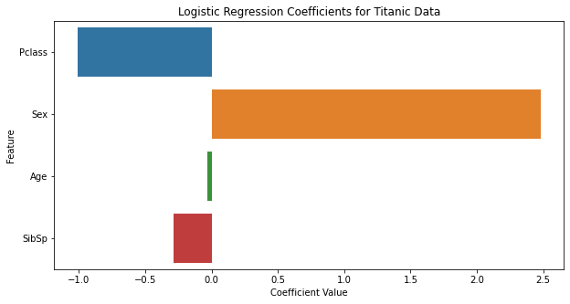
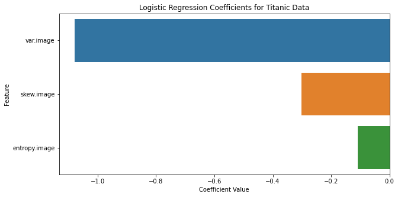

# Assignment #1


```python
# -*- coding: utf-8 -*-
# ================load library================
import pandas as pd
import matplotlib.pyplot as plt
import seaborn as sns
import numpy as np

# for spliting data into train and test
from sklearn.model_selection import train_test_split

# load accuracy method
from sklearn.metrics import accuracy_score

# load model method
from sklearn.linear_model import LogisticRegression
from sklearn.discriminant_analysis import LinearDiscriminantAnalysis, QuadraticDiscriminantAnalysis
from sklearn.naive_bayes import GaussianNB
# ============================================
```

## 1. Titanic


```python
# ================load dataset================
titanic = pd.read_csv("data/titanic/train.csv")

# select columns to use
titanic = titanic[["Pclass", "Sex", "Age", "SibSp", "Survived"]]
# ============================================
titanic.head()
```


<div>
<style scoped>
    .dataframe tbody tr th:only-of-type {
        vertical-align: middle;
    }

    .dataframe tbody tr th {
        vertical-align: top;
    }

    .dataframe thead th {
        text-align: right;
    }
</style>
<table border="1" class="dataframe">
  <thead>
    <tr style="text-align: right;">
      <th></th>
      <th>Pclass</th>
      <th>Sex</th>
      <th>Age</th>
      <th>SibSp</th>
      <th>Survived</th>
    </tr>
  </thead>
  <tbody>
    <tr>
      <th>0</th>
      <td>3</td>
      <td>male</td>
      <td>22.0</td>
      <td>1</td>
      <td>0</td>
    </tr>
    <tr>
      <th>1</th>
      <td>1</td>
      <td>female</td>
      <td>38.0</td>
      <td>1</td>
      <td>1</td>
    </tr>
    <tr>
      <th>2</th>
      <td>3</td>
      <td>female</td>
      <td>26.0</td>
      <td>0</td>
      <td>1</td>
    </tr>
    <tr>
      <th>3</th>
      <td>1</td>
      <td>female</td>
      <td>35.0</td>
      <td>1</td>
      <td>1</td>
    </tr>
    <tr>
      <th>4</th>
      <td>3</td>
      <td>male</td>
      <td>35.0</td>
      <td>0</td>
      <td>0</td>
    </tr>
  </tbody>
</table>
</div>


```python
titanic.info()
```

    <class 'pandas.core.frame.DataFrame'>
    RangeIndex: 891 entries, 0 to 890
    Data columns (total 5 columns):
     #   Column    Non-Null Count  Dtype  
    ---  ------    --------------  -----  
     0   Pclass    891 non-null    int64  
     1   Sex       891 non-null    object 
     2   Age       714 non-null    float64
     3   SibSp     891 non-null    int64  
     4   Survived  891 non-null    int64  
    dtypes: float64(1), int64(3), object(1)
    memory usage: 34.9+ KB


```python
# ============preprocessing data==============
# convert data type in "Sex" columns from object to int
titanic["Sex"] = titanic["Sex"].map({"male":1, "female":2})

# fill Nan values in "Age" columns
titanic["Age"] = titanic["Age"].fillna(titanic["Age"].mean()) 

# convert data type in "Age" from float to int
titanic["Age"] = titanic["Age"].astype("int")
# ============================================
titanic.head()
```


<div>
<style scoped>
    .dataframe tbody tr th:only-of-type {
        vertical-align: middle;
    }

    .dataframe tbody tr th {
        vertical-align: top;
    }

    .dataframe thead th {
        text-align: right;
    }
</style>
<table border="1" class="dataframe">
  <thead>
    <tr style="text-align: right;">
      <th></th>
      <th>Pclass</th>
      <th>Sex</th>
      <th>Age</th>
      <th>SibSp</th>
      <th>Survived</th>
    </tr>
  </thead>
  <tbody>
    <tr>
      <th>0</th>
      <td>3</td>
      <td>1</td>
      <td>22</td>
      <td>1</td>
      <td>0</td>
    </tr>
    <tr>
      <th>1</th>
      <td>1</td>
      <td>2</td>
      <td>38</td>
      <td>1</td>
      <td>1</td>
    </tr>
    <tr>
      <th>2</th>
      <td>3</td>
      <td>2</td>
      <td>26</td>
      <td>0</td>
      <td>1</td>
    </tr>
    <tr>
      <th>3</th>
      <td>1</td>
      <td>2</td>
      <td>35</td>
      <td>1</td>
      <td>1</td>
    </tr>
    <tr>
      <th>4</th>
      <td>3</td>
      <td>1</td>
      <td>35</td>
      <td>0</td>
      <td>0</td>
    </tr>
  </tbody>
</table>
</div>


```python
titanic.info()
```

    <class 'pandas.core.frame.DataFrame'>
    RangeIndex: 891 entries, 0 to 890
    Data columns (total 5 columns):
     #   Column    Non-Null Count  Dtype
    ---  ------    --------------  -----
     0   Pclass    891 non-null    int64
     1   Sex       891 non-null    int64
     2   Age       891 non-null    int64
     3   SibSp     891 non-null    int64
     4   Survived  891 non-null    int64
    dtypes: int64(5)
    memory usage: 34.9 KB


```python
# split dataset into 7:3
X_titanic = titanic.drop(["Survived"], axis=1)
y_titanic = titanic["Survived"]
X_train, X_test, y_train, y_test = train_test_split(X_titanic, y_titanic, test_size=0.3, random_state=42)
# ============================================
print(f"============ train set ============\nX_train: {X_train.shape}, y_train: {y_train.shape}")
print(f"============ test  set ============\nX_test:  {X_test.shape}, y_test:  {y_test.shape}\n===================================")
```

    ============ train set ============
    X_train: (623, 4), y_train: (623,)
    ============ test  set ============
    X_test:  (268, 4), y_test:  (268,)
    ===================================


### 1.1. Logistic Regression


```python
# =================train model================
# train
lr_model = LogisticRegression()
lr_model.fit(X_train, y_train)

# predict
lr_y_train = lr_model.predict(X_train)
lr_y_test = lr_model.predict(X_test)
# ============================================

# ==================Accuracy==================
lr_train_acc = round(accuracy_score(y_train, lr_y_train)*100, 2)
lr_acc = round(accuracy_score(y_test, lr_y_test)*100, 2)
# ============================================
print(f"Accuracy of LR train : {lr_train_acc}")
print(f"Accuracy of LR test  : {lr_acc}")
```

    Accuracy of LR train : 79.29
    Accuracy of LR test  : 81.72


#### Interprete Logistic Regression Model


```python
coef = pd.DataFrame({'Feature': X_train.columns, 'Coefficient': lr_model.coef_[0]})
print(f"Logistic Regression Coefficients for Titanic Data:\n{coef}")
```

    Logistic Regression Coefficients for Titanic Data:
      Feature  Coefficient
    0  Pclass    -1.012470
    1     Sex     2.481025
    2     Age    -0.034253
    3   SibSp    -0.289395


```python
plt.figure(figsize=(10, 5))
sns.barplot(x='Coefficient', y='Feature', data=coef, orient='h')
plt.title('Logistic Regression Coefficients for Titanic Data')
plt.xlabel('Coefficient Value')
plt.ylabel('Feature')
plt.show()
print(f"\n- Pclass: 좌석 등급의 수치가 낮을 수록(좌석 등급이 높을 수록) 생존 확률이 높아짐")
print(f"- Sex\t: 성별의 수치가 높을 수록(여성일 수록(1 남성 < 2 여성)) 생존 확률이 높아짐")
print(f"- Age\t: 나이가 어릴 수록 생존 확률이 높아짐")
print(f"- SibSp\t: 형제, 자매, 배우자의 수가 낮을 수록 생존 확률이 높아짐")
```


    

    


    
    - Pclass: 좌석 등급의 수치가 낮을 수록(좌석 등급이 높을 수록) 생존 확률이 높아짐
    - Sex	: 성별의 수치가 높을 수록(여성일 수록(1 남성 < 2 여성)) 생존 확률이 높아짐
    - Age	: 나이가 어릴 수록 생존 확률이 높아짐
    - SibSp	: 형제, 자매, 배우자의 수가 낮을 수록 생존 확률이 높아짐


### 1.2. LDA


```python
# =================train model================
# train
lda_model = LinearDiscriminantAnalysis()
lda_model.fit(X_train, y_train)

# predict
lda_y_train = lda_model.predict(X_train)
lda_y_test = lda_model.predict(X_test)
# ============================================

# ==================Accuracy==================
lda_train_acc = round(accuracy_score(y_train, lda_y_train)*100, 2)
lda_acc = round(accuracy_score(y_test, lda_y_test)*100, 2)
# ============================================
print(f"Accuracy of LDA train : {lda_train_acc}")
print(f"Accuracy of LDA test  : {lda_acc}")
```

    Accuracy of LDA train : 79.78
    Accuracy of LDA test  : 80.6


### 1. 3. QDA


```python
# =================train model================
# train
qda_model = QuadraticDiscriminantAnalysis()
qda_model.fit(X_train, y_train)

# predict
qda_y_train = qda_model.predict(X_train)
qda_y_test = qda_model.predict(X_test)
# ============================================

# ==================Accuracy==================
qda_train_acc = round(accuracy_score(y_train, qda_y_train)*100, 2)
qda_acc = round(accuracy_score(y_test, qda_y_test)*100, 2)
# ============================================
print(f"Accuracy of QDA train : {qda_train_acc}")
print(f"Accuracy of QDA test  : {qda_acc}")
```

    Accuracy of QDA train : 81.38
    Accuracy of QDA test  : 81.72


### 1. 4. Naïve Bayes


```python
# =================train model================
# train
nb_model = GaussianNB()
nb_model.fit(X_train, y_train)

# predict
nb_y_train = nb_model.predict(X_train)
nb_y_test = nb_model.predict(X_test)
# ============================================

# ==================Accuracy==================
nb_train_acc = round(accuracy_score(y_train, nb_y_train)*100, 2)
nb_acc = round(accuracy_score(y_test, nb_y_test)*100, 2)
# ============================================
print(f"Accuracy of NB train : {nb_train_acc}")
print(f"Accuracy of NB test  : {nb_acc}")
```

    Accuracy of NB train : 77.21
    Accuracy of NB test  : 77.61


### Result


```python
print("================Accuracy==============")
print("Model\t\t\t|Train\t|Test")
print("------------------------|-------|-----")
print(f"Logistic Regression\t|{lr_train_acc}\t|{lr_acc}")
print(f"LDA\t\t\t|{lda_train_acc}\t|{lda_acc}")
print(f"QDA\t\t\t|{qda_train_acc}\t|{qda_acc}")
print(f"Naïve Bayes\t\t|{nb_train_acc}\t|{nb_acc}")
print("======================================")
```

    ================Accuracy==============
    Model			|Train	|Test
    ------------------------|-------|-----
    Logistic Regression	|79.29	|81.72
    LDA			|79.78	|80.6
    QDA			|81.38	|81.72
    Naïve Bayes		|77.21	|77.61
    ======================================


## 2. Bank Note


```python
# ================load dataset================
banknote = pd.read_csv("data/banknote.txt", sep=",", header=None)

# rename columns
banknote.columns = ["var.image", "skew.image", "curtosis.imgae", "entropy.image", "class"]

# select columns to use
banknote = banknote[["var.image", "skew.image", "entropy.image", "class"]]
# # ============================================
banknote.head()
```


<div>
<style scoped>
    .dataframe tbody tr th:only-of-type {
        vertical-align: middle;
    }

    .dataframe tbody tr th {
        vertical-align: top;
    }

    .dataframe thead th {
        text-align: right;
    }
</style>
<table border="1" class="dataframe">
  <thead>
    <tr style="text-align: right;">
      <th></th>
      <th>var.image</th>
      <th>skew.image</th>
      <th>entropy.image</th>
      <th>class</th>
    </tr>
  </thead>
  <tbody>
    <tr>
      <th>0</th>
      <td>3.62160</td>
      <td>8.6661</td>
      <td>-0.44699</td>
      <td>0</td>
    </tr>
    <tr>
      <th>1</th>
      <td>4.54590</td>
      <td>8.1674</td>
      <td>-1.46210</td>
      <td>0</td>
    </tr>
    <tr>
      <th>2</th>
      <td>3.86600</td>
      <td>-2.6383</td>
      <td>0.10645</td>
      <td>0</td>
    </tr>
    <tr>
      <th>3</th>
      <td>3.45660</td>
      <td>9.5228</td>
      <td>-3.59440</td>
      <td>0</td>
    </tr>
    <tr>
      <th>4</th>
      <td>0.32924</td>
      <td>-4.4552</td>
      <td>-0.98880</td>
      <td>0</td>
    </tr>
  </tbody>
</table>
</div>


```python
banknote.info() # no need to preprocess
```

    <class 'pandas.core.frame.DataFrame'>
    RangeIndex: 1372 entries, 0 to 1371
    Data columns (total 4 columns):
     #   Column         Non-Null Count  Dtype  
    ---  ------         --------------  -----  
     0   var.image      1372 non-null   float64
     1   skew.image     1372 non-null   float64
     2   entropy.image  1372 non-null   float64
     3   class          1372 non-null   int64  
    dtypes: float64(3), int64(1)
    memory usage: 43.0 KB


```python
# split dataset into 7:3
X_banknote = banknote.drop(["class"], axis=1)
y_banknote = banknote["class"]
X_train, X_test, y_train, y_test = train_test_split(X_banknote, y_banknote, test_size=0.3, random_state=42)
# ============================================
print(f"============ train set ============\nX_train: {X_train.shape}, y_train: {y_train.shape}")
print(f"============ test  set ============\nX_test:  {X_test.shape}, y_test:  {y_test.shape}\n===================================")
```

    ============ train set ============
    X_train: (960, 3), y_train: (960,)
    ============ test  set ============
    X_test:  (412, 3), y_test:  (412,)
    ===================================


### 2.1. Logistic Regression


```python
# =================train model================
# train
lr_model = LogisticRegression()
lr_model.fit(X_train, y_train)

# predict
lr_y_train = lr_model.predict(X_train)
lr_y_test = lr_model.predict(X_test)
# ============================================

# ==================Accuracy==================
lr_train_acc = round(accuracy_score(y_train, lr_y_train)*100, 2)
lr_acc = round(accuracy_score(y_test, lr_y_test)*100, 2)
# ============================================
print(f"Accuracy of LR train : {lr_train_acc}")
print(f"Accuracy of LR test  : {lr_acc}")
```

    Accuracy of LR train : 87.92
    Accuracy of LR test  : 87.62


#### Interprete Logistic Regression


```python
coef = pd.DataFrame({'Feature': X_train.columns, 'Coefficient': lr_model.coef_[0]})
print(f"Logistic Regression Coefficients for Titanic Data:\n{coef}")
```

    Logistic Regression Coefficients for Titanic Data:
             Feature  Coefficient
    0      var.image    -1.078808
    1     skew.image    -0.301609
    2  entropy.image    -0.109653


```python
plt.figure(figsize=(10, 5))
sns.barplot(x='Coefficient', y='Feature', data=coef, orient='h')
plt.title('Logistic Regression Coefficients for Titanic Data')
plt.xlabel('Coefficient Value')
plt.ylabel('Feature')
plt.show()
print(f"\n- var.image : 이미지의 분산이 낮을 수록 진폐일 확률이 높아짐(위조 지폐일 확률 낮아짐)")
print(f"- skew.image: 이미지의 기울기가 낮을 수록 진폐일 확률이 높아짐(위조 지폐일 확률 낮아짐)")
print(f"- skew.image: 이미지의 곡률이 낮을 수록 진폐일 확률이 높아짐(위조 지폐일 확률 낮아짐)")
```


    

    


    
    - var.image : 이미지의 분산이 낮을 수록 진폐일 확률이 높아짐(위조 지폐일 확률 낮아짐)
    - skew.image: 이미지의 기울기가 낮을 수록 진폐일 확률이 높아짐(위조 지폐일 확률 낮아짐)
    - skew.image: 이미지의 곡률이 낮을 수록 진폐일 확률이 높아짐(위조 지폐일 확률 낮아짐)


### 2.2. LDA


```python
# =================train model================
# train
lda_model = LinearDiscriminantAnalysis()
lda_model.fit(X_train, y_train)

# predict
lda_y_train = lda_model.predict(X_train)
lda_y_test = lda_model.predict(X_test)
# ============================================

# ==================Accuracy==================
lda_train_acc = round(accuracy_score(y_train, lda_y_train)*100, 2)
lda_acc = round(accuracy_score(y_test, lda_y_test)*100, 2)
# ============================================
print(f"Accuracy of LDA train : {lda_train_acc}")
print(f"Accuracy of LDA test  : {lda_acc}")
```

    Accuracy of LDA train : 87.92
    Accuracy of LDA test  : 88.35


### 2.3. QDA 


```python
# =================train model================
# train
qda_model = QuadraticDiscriminantAnalysis()
qda_model.fit(X_train, y_train)

# predict
qda_y_train = qda_model.predict(X_train)
qda_y_test = qda_model.predict(X_test)
# ============================================

# ==================Accuracy==================
qda_train_acc = round(accuracy_score(y_train, qda_y_train)*100, 2)
qda_acc = round(accuracy_score(y_test, qda_y_test)*100, 2)
# ============================================
print(f"Accuracy of QDA train : {qda_train_acc}")
print(f"Accuracy of QDA test  : {qda_acc}")
```

    Accuracy of QDA train : 89.17
    Accuracy of QDA test  : 89.08


### 2.4. Naïve Bayes


```python
# =================train model================
# train
nb_model = GaussianNB()
nb_model.fit(X_train, y_train)

# predict
nb_y_train = nb_model.predict(X_train)
nb_y_test = nb_model.predict(X_test)
# ============================================

# ==================Accuracy==================
nb_train_acc = round(accuracy_score(y_train, nb_y_train)*100, 2)
nb_acc = round(accuracy_score(y_test, nb_y_test)*100, 2)
# ============================================
print(f"Accuracy of NB train : {nb_train_acc}")
print(f"Accuracy of NB test  : {nb_acc}")
```

    Accuracy of NB train : 87.71
    Accuracy of NB test  : 85.44


### Result


```python
print("================Accuracy==============")
print("Model\t\t\t|Train\t|Test")
print("------------------------|-------|-----")
print(f"Logistic Regression\t|{lr_train_acc}\t|{lr_acc}")
print(f"LDA\t\t\t|{lda_train_acc}\t|{lda_acc}")
print(f"QDA\t\t\t|{qda_train_acc}\t|{qda_acc}")
print(f"Naïve Bayes\t\t|{nb_train_acc}\t|{nb_acc}")
print("======================================")
```

    ================Accuracy==============
    Model			|Train	|Test
    ------------------------|-------|-----
    Logistic Regression	|87.92	|87.62
    LDA			|87.92	|88.35
    QDA			|89.17	|89.08
    Naïve Bayes		|87.71	|85.44
    ======================================

